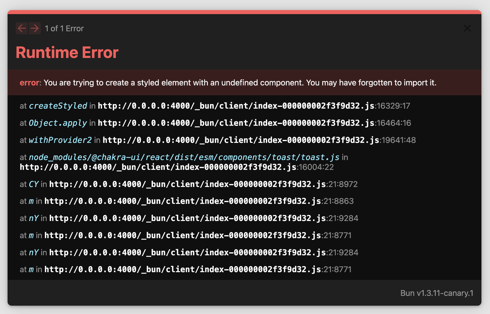

# Minimal repro of Bun barrel exports issue with Chakra-UI

Minimal reproduction of an issue where barrel exports inside Chakra-UI break both dev and production builds, in Bun `1.3.11-canary.1+d50ab984c`, which should (?) have the fixes introduced in [#27524](https://github.com/oven-sh/bun/pull/27524).

## Setup

I installed `@chakra-ui/react` and `@chakra-ui/cli`; then I ran:

```sh
$ bunx chakra snippet add toaster --outdir src/client/components/ui
$ bunx chakra snippet add provider --outdir src/client/components/ui
```

Then I inserted these generated components into App.tsx.

## To reproduce

To start the server:

```sh
bun dev
```

Open the browser at the given URL (e.g. <localhost:4000>):



This happens immediately when the server is visited, no HMR needed. If you go into `src/client/components/ui/toaster.tsx` and save the file (`touch` doesn't do it, for whatever reason), HMR will reload the component and the page will render without errors.

### Production

You can also reproduce this in production:

```sh
bun run build
bun run serve
```

Visit the URL shown, e.g. <localhost:4000>, and you won't see the Bun error screen, which is dev-only, but if you look in your browser's console, you should see `Uncaught ReferenceError: ToastRoot2 is not defined`.
